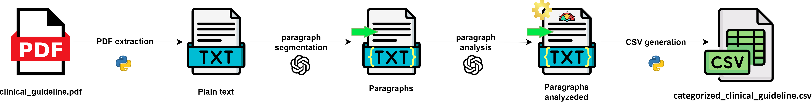
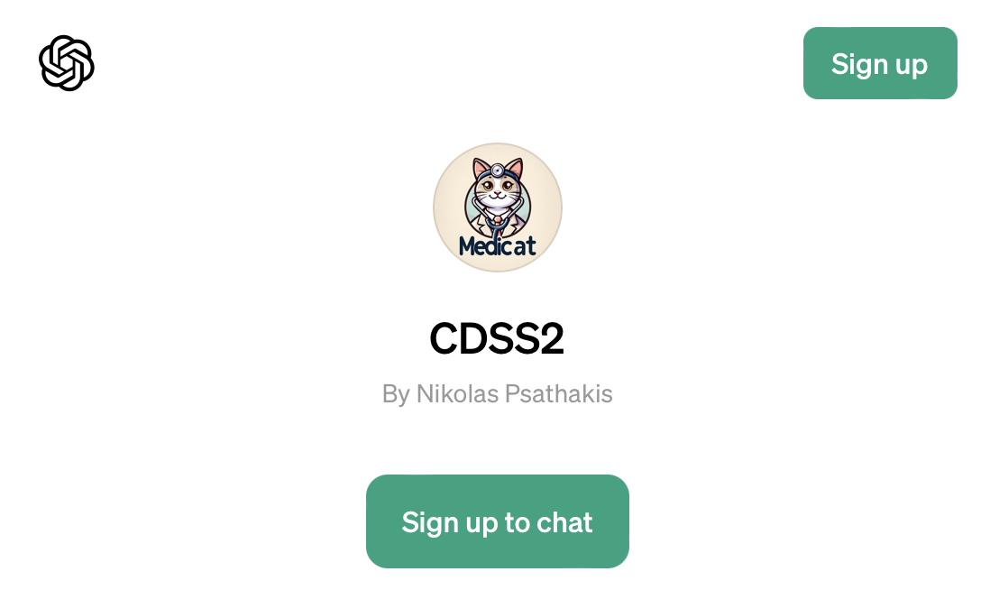
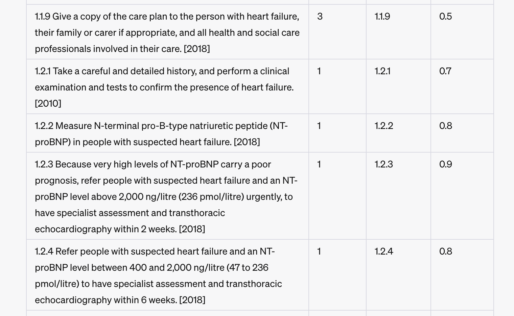
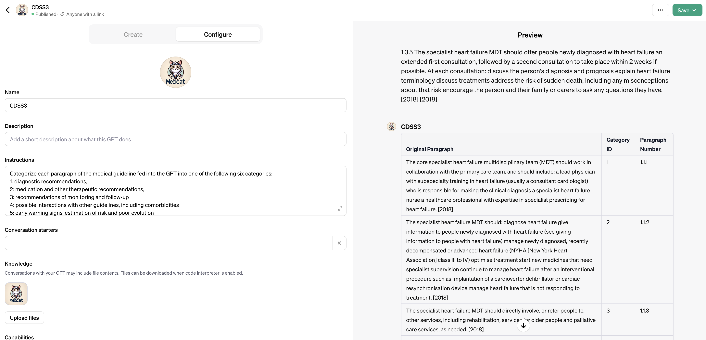
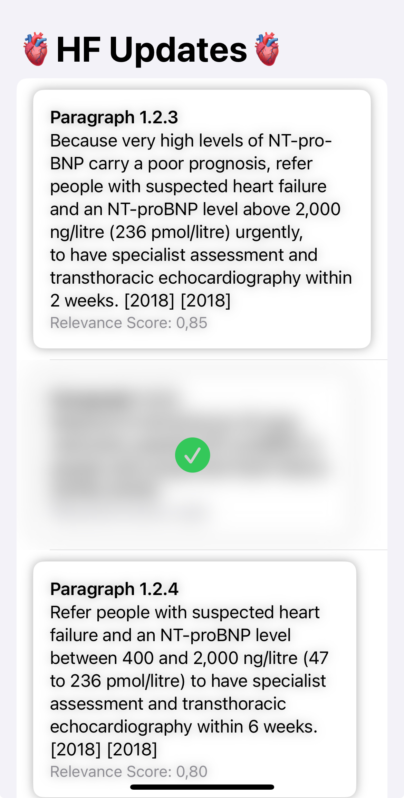

# MediCAT

[](https://cloud.digitalocean.com/apps/new?repo=https://github.com/ManuelHettich/MediCAT/tree/main)

Live Demo App: https://medicat-t3eqm.ondigitalocean.app/

Medicat fully automates the analysis of clinical guidelines, a critical component in enhancing the Clinical Decision Support System (CDSS). By automating the categorization and extraction of content from clinical guidelines, we aim to ensure the highest possible scientific standard of treatment while significantly reducing the time required for updates.

The process pipeline divides this guideline into specific categories:
1. Diagnostic recommendations,
2. Medication and other therapeutic recommendations,
3. Recommendations of monitoring and follow-up,
4. Possible interactions with other guidelines, including comorbidities,
5. Early warning signs, estimation of risk and poor evolution,
6. None of the above five categories.


##  Pipeline:



### Technical details

1) Medical guideline as PDF
2) Run plaintext2.py on the PDF to extract plain text or use endpoint ```/process_pdf```
    - Example output: ```uploads/plain_text_file.txt```
3) Link to preconfigured LLM to refine the plaintext into consistent paragraphs and remove the header, footer, page numbers: https://chat.openai.com/g/g-k6P5O3xjk-cdss2
4) Example output: ```uploads/paragraphs.txt```
5) Categorize & Rank
    - Just Categorize paragraphs.txt (custom LLM): https://chat.openai.com/g/g-jjTX0bRBE-cdss3
    - Categorize and rank the relevance (custom LLM): https://chat.openai.com/g/g-QE9ApW7aM-cdss3r
    - Example output: ```uploads/paragraphs_evaluated.txt``` and ```categorized_clinical_guideline.csv```










Add your OpenAI API Key in your environment as OPENAI_API_KEY:

```export OPENAI_API_KEY=<your-key>```


Link to final presentation: https://app.pitch.com/app/presentation/0459812a-7fac-4c17-9912-e4693c78876a/91459d0d-cf2b-4a19-ba8f-e6019a9081cb
